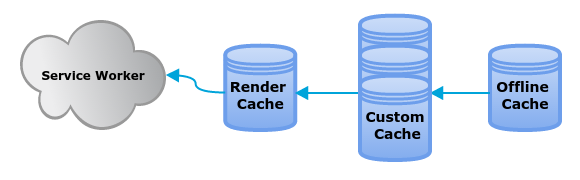

Une nouvelle architecture pour nos applications web mobiles
===========================================================

Le Web mobile existe depuis quelques années maintenant. Si on voulait prendre un
raccourci simpliste, on dirait qu'il est arrivé (du moins massivement) avec le
premier iPhone.

De même, nous créons des applications Web depuis quelques années. Si on voulait
prendre un raccourci simpliste, on dirait que cette mouvance est arrivée avec
GMail et Google Maps. Ah oui, je vais appeler «applications web» ces
sites web qui fonctionnent surtout en JavaScript et qui s'exécutent sur le poste
client de l'utilisateur.

Depuis ces quelques années, la communauté Web a créé des bibliothèques pour se
simplifier la vie et retrouver les automatismes d'autres environnements:
programmation suivant le [paradigme MVC](http://todomvc.com/), concept nouveau (ou pas) de voir les
interactions utilisateurs [comme un cycle](http://cycle.js.org/), coupler les [vues HTML et leur
comportement](https://facebook.github.io/react/) en JavaScript. Liste non exhaustive, vous en conviendrez.

Dans [Firefox OS](https://www.mozilla.org/fr/firefox/os/), nous avons fait le choix dès le départ de ne pas utiliser de
telles bibliothèques toutes faites. En effet, bien qu'elles soient utiles pour
le développement multi-navigateurs, elles le sont moins dès lors que l'on développe
pour un unique moteur (en l'occurrence, Gecko). De plus elles cachent trop
souvent les problèmes de la plate-forme Web alors que notre but est bien de
trouver ceux-ci afin de les corriger.

Des *Single-Page-Apps* classiques
---------------------------------

Les applications développées pour Firefox OS utilisent néanmoins des mécanismes
de *Single-Page-Apps* classiques (ce sont des applications qui s'exécutent entièrement dans une
page HTML unique): chargement d'une URL unique, systèmes qui
permettent d'afficher ou cacher des vues en fonction des actions utilisateurs,
éventuellement en modifiant l'URL, des objets en mémoire qui contiennent le
modèle.

Cela fonctionne correctement bien puisqu'on arrive à avoir des chiffres de
performance proches des mêmes applications pour Android tournant sur les mêmes
téléphones.

Cependant on voit aussi que l'on arrive à la limite de cette méthode.

Les problèmes de la méthode classique
-------------------------------------
### Utilisation d'application _packagées_

Toutes les applications préinstallées, ainsi qu'une partie des applications
installées sur le [Marketplace](https://marketplace.firefox.com/), sont sous forme _packagées_, c'est-à-dire
qu'elles se présentent sous forme d'une archive ZIP. Cela avait été rendu
nécessaire pour la volonté de signer une application afin de lui accorder des
privilèges supplémentaires.

Mais il faut avouer que ce n'est pas très «Web», cette archive !

### Gestion des mises à jour

Cette utilisation d'une archive ZIP a plusieurs désavantages. Le moindre n'est
pas le souci des mises à jour. En effet, on est alors obligé de mettre à jour
l'ensemble de l'application même si un seul fichier change.

Par ailleurs, puisque les applications préinstallées ne proviennent pas du
Marketplace, elles ne peuvent être mises à jour qu'avec l'ensemble du système.

### Vitesse du lancement et performance ressentie

C'est évidemment une métrique très importante pour l'utilisateur. Or dans une
Single-Page App on doit forcément contrôler minutieusement le chargement initial
pour permettre un affichage rapide du premier rendu, et ce n'est pas trivial.

### Fluidité des animations

On le sait, sur mobile, les animations doivent absolument tourner sur le GPU. Il
n'empêche que même ainsi il est trop facile de rendre une animation hachée,
et surtout on y est très sensible en tant qu'humain. Il suffit de faire tourner
un peu trop de JavaScript ou déclencher un reflow au mauvais moment, sur le
thread principal.

### Gestion de la mémoire

Avec le modèle de la Single-Page App, on va garder dans une seule page
l'ensemble des données nécessaires à l'exécution de l'application, ainsi que
l'ensemble du markup nécessaire. Évidemment il y a des techniques pour améliorer
cela, mais là encore, ce n'est pas trivial.

Par ailleurs, il est très compliqué de libérer la mémoire proprement une fois
qu'elle a été allouée. Et au contraire il est très facile de conserver une
petite référence dans un coin `\_°<` qui empêche le *garbage collector* de faire
son boulot correctement. Par exemple, on oublie trop facilement d'enlever des
gestionnaire d'événements.

### Utilisation des cœurs multiples

Intrinsèquement le langage JavaScript utilise un modèle à thread unique, ce qui
signifie qu'en général un seul code JavaScript ne peut tourner à un instant
donné, même si le matériel qui fait tourner le code contient plusieurs
processeurs. C'est d'autant plus important sur mobile où les processeurs ne sont
pas particulièrement véloces __mais__ multiples.

### Adaptation de l'interface

Il faut savoir que Firefox OS tourne aujourd'hui tant sur des [téléphones
d'entrée de gamme](https://www.mozilla.org/fr/firefox/os/devices/) que sur des
[télévisions 4K](https://www.mozilla.org/fr/firefox/os/devices/tv/). Or il est
aujourd'hui difficile d'adapter l'interface à différents contextes. Quand
bien même les vues seraient bien délimitées par rapport au code JavaScript, il
est difficile de changer simplement son apparence ou son agencement.

Pour aller plus loin, il est extrêmement difficile de changer d'apparence à la
volée, comme pourrait le faire un système de thèmabilité.

Des outils d'ores et déjà disponibles
-------------------------------------

La plate-forme Web nous apporte des choses dès maintenant: les (Shared) Workers,
les détestées IFrames, les canaux de communication comme BroadcastChannel ou
MessageChannel, et les Service Workers.

### Les [Workers](https://developer.mozilla.org/en-US/docs/Web/API/Web_Workers_API/Using_web_workers) pour exécuter du code en parallèle

Ah les Workers ! On sait que ça existe, mais on ne les utilise pas. Il faut
avouer que c'est un peu pénible. Notamment on n'a pas accès à la `window`, et
donc ni au DOM ni à beaucoup d'APIs. Jusqu'à récemment on ne pouvait même pas utiliser
indexedDB, un comble ! On peut consulter [la page dédiée sur
MDN](https://developer.mozilla.org/en-US/docs/Web/API/Web_Workers_API/Functions_and_classes_available_to_workers)
pour connaître les APIs disponibles.

C'est néanmoins un outil fondamental, puisque c'est lui qui nous extraie du
modèle «thread unique» du JavaScript.

Il faut savoir qu'il en existe deux types: les *Worker*s simples, dédiés à une
page Web particulière, et les *SharedWorker*s qui, comme leur nom l'indique,
sont partagés entre plusieurs pages d'une même origine.

### Les IFrames pour séparer facilement des parties de l'application

Les plus vieux d'entre nous se rappellent bien de l'utilisation des frames dans
les sites web des années 90, et depuis lors leur simple évocation nous provoque des
frissons dans le dos.

Cependant l'IFrame reste un outil très utile: elle permet l'encapsulation totale
d'un document, tant au niveau du DOM qu'au niveau JavaScript. Cela permet de
réduire les impacts des reflows (puisque le DOM est divisé en plusieurs arbres),
et de libérer très facilement la mémoire prise par ces sous-documents (il suffit
de supprimer l'IFrame du DOM principal).

D'ailleurs, dans Firefox OS, chaque application vit dans son IFrame.

### [BroadcastChannel](https://developer.mozilla.org/en-US/docs/Web/API/Broadcast_Channel_API) et [MessageChannel](https://developer.mozilla.org/en-US/docs/Web/API/Channel_Messaging_API/Using_channel_messaging) pour communiquer facilement

Ces deux objets font partie de nouvelles spécifications pour permettre aux
applications de communiquer plus facilement entre leurs différentes pages ou
scripts.

Comme son nom l'indique, avec `BroadcastChannel` une partie de l'application va
pouvoir s'abonner à un certain canal alors qu'une autre partie va pouvoir
y publier des messages. On n'a pas besoin d'avoir une référence vers la fenêtre
ou le script destination comme avec `postMessage`. Et cela fonctionne tant dans
la page principale que dans les IFrames ou les Workers. On peut voir ça comme un
gestionnaire d'événements global à une application et qui traverserait les
couches d'IFrames et de Workers.

`MessageChannel` est assez différent: il permet une communication
bidirectionnelle entre deux points d'une application. En ce sens c'est beaucoup
plus proche de `postMessage`, que l'on va d'ailleurs devoir utiliser pour passer
le port de communication à l'une des parties.

### Les [Service Workers](https://developer.mozilla.org/en-US/docs/Web/API/Service_Worker_API/Using_Service_Workers): une gestion programmatique du cache, et plus

On ne va pas trop rentrer dans les détails ici. C'est en effet un sujet très
riche.

En gros, ce qu'il faut savoir:

* Ça se place en coupure de toutes les requêtes HTTP et HTTPS. En clair, ça
  signifie qu'on va pouvoir intercepter toutes les requêtes et exécuter du code
  avant et/ou après la requête, voire la remplacer entièrement par autre chose.

  Ça signifie qu'on contrôle totalement le fonctionnement réseau de notre
  application. On peut même implémenter des URLs qui n'existent pas vraiment.

* Au sein d'un Service Worker on a accès à une API spécialisée dans le stockage
  de contenu avec une clé (l'API Cache). Cette API de cache est complètement
  sous le contrôle du code JavaScript du Service Worker.

  On peut aussi chaîner facilement plusieurs caches qui auraient des
  sémantiques différentes.

* Un Service Worker va être installé par une application au premier accès, ou
  bien à son installation avec l'utilisation d'un manifest. Après cette
  installation, il pourra être actif quand bien même aucune fenêtre de
  l'application n'est active ou même exécutée en fond.

  Un Service Worker suit néanmoins un cycle de vie bien spécifié. Il n'est donc
  pas constamment actif, mais le moteur peut le «réveiller» lorsqu'il en a
  besoin.

  Ainsi certaines APIs l'utilisent d'ores et déjà, c'est le cas de l'API
  Push Notification (ce qui permet à une application Web de recevoir des
  notifications venant du serveur). À l'avenir d'autres APIs vont suivre le même
  chemin.

Bref, les Service Workers vont révolutionner notre manière de réaliser des
applications Web. Pour l'instant on n'a fait qu'écorcher la surface.

Utilisons ces outils pour concevoir l'architecture de demain
------------------------------------------------------------
Vous vous rappelez nos problèmes initiaux ? Essayons à présent de les résoudre !

### Utilisation des Service Workers

Les Service Workers vont avoir beaucoup d'intérêt puisqu'ils vont à la fois
permettre de gérer l'installation, les mises à jour, la mise en cache, la
gestion de certaines APIs.

Pour définir plus facilement les URLs à traiter, ainsi que que la gestion de la
mise en cache, nous avons développé la bibliothèque
[ServiceWorkerWare](https://github.com/gaia-components/serviceworkerware) qui
permet de définir cela de manière très déclarative en s'attachant aux
différentes phases du cycle de vie du Worker. Elle fournit également deux
implémentations de base pour la mise en cache.

Nous avons prévu d'implémenter trois caches:
* le cache Offline dont le but est de conserver les fichiers applicatifs
  localement;
* le ou les caches de personnalisation, qui vont permettre notamment de modifier
  certaines vues ou comportement à la volée;
* le cache de rendu, qui permettra de cacher et renvoyer très rapidement l'arbre
  HTML généré par une exécution précédente. Ce cache pourra aussi être prégénéré
  à l'installation, et notamment prendre en compte la localisation du téléphone,
  ce qui fera gagner un temps précieux au chargement de l'application.

### Utilisation de documents séparés pour chaque vue

C'est sans doute l'une des idées-phares de cette architecture: à chaque vue
correspond un document HTML complètement séparé. Cela permet de ne charger que
les fichiers nécessaires pour chaque vue, de n'utiliser que la mémoire
nécessaire, et surtout de la libérer facilement lorsqu'on n'en a plus besoin.

Évidemment il faut pouvoir passer rapidement d'une page à une autre, tel que
l'on en a pris l'habitude avec les applications natives ou les applications en
Singe-Page. Pour cela, il y a plusieurs angles d'approches:

* Implémentation d'une [nouvelle API de gestion des transitions entre les pages](http://chrislord.net/index.php/2015/04/24/web-navigation-transitions/).
  Cette API est encore en cours de discussion.
* Implémentation d'une API de prerendering comme le fait déjà Blink. Cela
  permettra de prérendre en mémoire la vue qui a le plus de chance d'être
  visitée ensuite, ou bien de la prérendre en mémoire avant de l'afficher.
* Implémentation d'une logique de cache des fichiers JavaScript réutilisés entre
  les pages.

Il est à noter que tout cela n'est évidemment pas dédié à Firefox OS uniquement
mais est destiné à profiter également au navigateur Firefox.

### Utilisation massive des Workers

Nous allons utiliser des Shared Workers pour contenir tout le modèle d'une
application. L'interface entre les Workers et la vue peut être codifiée sous
forme d'une interface de services. Ainsi il est plus facile de modifier la vue
sans toucher aux services, et inversement.

Ainsi nous déportons une grande partie de la logique métier dans un thread
séparé ce qui libère du temps CPU pour le calcul de rendu de l'interface Web.

La [bibliothèque bridge](https://github.com/gaia-components/bridge) permet de
facilement exposer des services d'un Shared Worker et d'y accéder depuis une
vue.

### Utilisation des [Web Components](https://developer.mozilla.org/fr/docs/Web/Web_Components)

Ce n'est pas directement lié à ce dont nous avons parlé plus tôt, mais nous
avons néanmoins décidé d'utiliser massivement les Web Components. Nous avons
commencé à développer [un certain nombre de composants sur
Github](https://github.com/gaia-components/).

Notamment le composant
[gaia-fast-list](https://github.com/gaia-components/gaia-fast-list) vise à
permettre l'utilisation de listes de grande taille («liste infinie») tout en
gardant un défilement fluide.

On pourra aussi consulter la [présentation de Wilson Page sur les Web
Components](http://wilsonpage.github.io/presentations/web-components-in-production/#/)
(avec Firefox bien sûr !).

Une nouvelle architecture pour une nouvelle époque
--------------------------------------------------

Vous l'aurez compris, cette architecture montre une rupture avec les techniques
actuelles: utilisation massive des Workers, arrivée des Service Workers,
techniques de cache et de prerendering. Mais surtout, elle revient aux origines
du Web: une vue est un document avec son URL, et on navigue dans l'application
comme on navigue entre documents. Pour en savoir plus, on pourra aller lire [la
proposition complète sur le Wiki de Firefox OS](https://wiki.mozilla.org/Gaia/Architecture_Proposal).

Il est totalement possible que tout ou partie de cette
architecture ne fonctionnera pas. Il faut néanmoins l'essayer avant de pouvoir
en tirer des conclusions. Peut-être dans l'édition 2016 de 24 jours du web ? ;)

Et vous, qu'en pensez-vous ?

Crédits
-------
L'image de l'architecture des applications a été réalisées par Jérémie
Patonnier.

L'image des caches dans un Service Worker a été réalisée par Vivien Nicolas.
